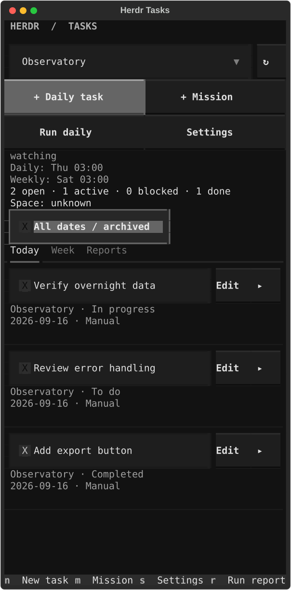

# Herdr Tasks

A right-side task panel for Herdr, with daily project reports and weekly missions.

- **Today:** manual and generated tasks, checkboxes, notes, and to-do / in-progress / blocked / completed status.
- **Week:** weekly missions, with optional links from daily tasks.
- **Reports:** a summary and status for each Herdr space, suggested tasks to add, coverage gaps, retries, and Markdown exports.
- **Two reporting roles:** a summarizer followed by a planner; choose Codex or Claude independently for each.
- **Shared local state:** projects and tasks stay available across Herdr tabs, sessions, and restarts.



## Install

Requires Linux, Python 3.11+, and Herdr 0.9.0+. Reporting also requires a logged-in Codex or Claude CLI available to the Herdr server. Compatibility was checked against Herdr 0.9.0, Codex 0.154.0, and Claude Code 2.1.272.

From the checkout, inside Herdr:

```sh
python3 scripts/install.py
```

This creates `.venv`, installs the pinned dependencies, links this checkout as a Herdr plugin, and starts its coordinator. Keep the checkout at this location while it is linked. Installation enables future scheduled reports with the defaults below; the first launch establishes a starting point without generating an immediate historical report.

From a terminal pane inside Herdr, open or close the board with:

```sh
herdr plugin action invoke herdr-tasks.toggle
```

Herdr 0.9.0 exposes plugin actions through CLI commands and custom keybindings. To open reports or settings directly, invoke `herdr-tasks.reports` or `herdr-tasks.settings` with the same command. Inside the board, use its buttons and keyboard shortcuts.

For a keyboard shortcut, add an unused binding to your Herdr config:

```toml
[[keys.command]]
key = "prefix+y"
type = "plugin_action"
command = "herdr-tasks.toggle"
description = "toggle task panel"
```

Reload the config using Herdr's normal configuration controls. The installer does not change existing bindings.

The panel is a normal split at the right edge of the current tab. It can be resized with Herdr's split controls. Toggling it again closes only that task panel. Existing terminal processes are preserved.

## Use the board

| Control | Action |
| --- | --- |
| Checkbox | Complete a task or reopen it as to-do |
| ▸ / ▾ beside Edit | Expand or collapse task notes without editing or completing the task |
| Edit | Change title, notes, date, status, project, or linked mission; archive/restore |
| `n` / + Daily task | Add a task by hand |
| `m` / + Mission | Add a weekly mission by hand |
| `s` / Settings | Set schedules and the two reporting providers |
| `r` / Run daily | Request a report and plan immediately |
| Reports → Run weekly | Request a daily and weekly report and plan immediately |
| Reports → Add to tasks / Add mission | Add an individual planner suggestion to the board |
| `h` / All dates / archived | Include future, older completed, and archived tasks |
| `q` / Escape | Close the board; Escape in an editor cancels that edit |

Each **Herdr space (workspace)** is one project. The selector uses its Herdr name, and opening the panel selects its current space. Choose **All spaces** to see everything. All agents and tabs within a space contribute to its tasks and reports, even when they use different folders. Separate spaces remain separate when they share a repository or folder; renaming a space keeps its tasks attached.

Spaces are discovered automatically across local Herdr sessions. The **↻** button refreshes them immediately. Create and rename spaces using Herdr's normal workspace controls. Daily tasks and weekly missions are added manually inside a selected space.

On upgrade from folder grouping, the plugin saves a `tasks.sqlite3.before-spaces` backup. Existing tasks, completion states, notes, links, activity, and reports are preserved. A previous folder is assigned automatically when it matches exactly one space. Ambiguous assignments or conflicting open task titles remain under **Unassigned: …**; use Edit → Space to assign them. Historical reports retain their original content and remain accessible.

Open tasks carry forward until you complete or archive them. Today and Week show tasks due by the current planning period and tasks completed during that period. Future tasks are available through History. Weekly dates mean the **start** of the planning week. Completing a mission does not automatically complete its daily tasks.

The planner saves **suggestions in Reports**. Read each suggestion's title, description, space, and planned date, then choose **Add to tasks** or **Add mission**. Suggestions do not enter the board automatically. Added tasks start unchecked; the button becomes **Added**. Suggestions matching existing tasks show **Already tracked**, including completed or archived tasks. Repeated clicks and acceptance from another panel do not create duplicates. Existing tasks from earlier plugin versions are preserved.

The planner cannot complete, reopen, rewrite, or redate existing tasks. You can still create a new manual task with a previously completed title. Concurrent edits from another panel ask you to reopen the task. Suggestions retain the planning date of their report; an accepted older suggestion carries forward as open work. Exported reports label suggestion status at export time; use Retry / Export to update that snapshot after adding tasks.

On terminals shorter than 36 rows, secondary buttons and the schedule details are hidden to leave room for tasks; keyboard shortcuts remain available. Long titles can be read in Edit.

## Overnight reporting

Defaults:

| Setting | Default |
| --- | --- |
| Timezone | Asia/Jerusalem |
| Daily cutoff | 03:00 |
| Weekly cutoff | Saturday 03:00, including Friday's work |
| Summarizer | Codex, configured model and reasoning effort |
| Planner | Codex, configured model and reasoning effort |
| Passive sampling | Every 30 seconds, plus relevant Herdr events |
| Existing-agent reply timeout | 120 seconds per agent |
| Summary / planner timeout | 600 seconds per role |

Each batch:

1. Reads local session and agent state, grouped by space, with recorded terminal activity, task history, and bounded Git status/commit metadata from up to four directories per space.
2. Asks each ready idle/done agent for one short progress update. Busy, blocked, replaced, disconnected, or uncertain agents are reported as coverage gaps. A possibly delivered prompt is never automatically submitted again within that run.
3. Runs the summarizer and saves each project's report and status.
4. Runs the planner and saves validated daily-task suggestions and, on weekly runs, weekly-mission suggestions for review in Reports.

Summary and planning run **sequentially**. They use noninteractive CLI processes with reporting tools disabled. Existing interactive agents receive a report-only request using their current context; their own permission settings still govern that conversation. The plugin does not launch agents to execute the missions.

At the weekly cutoff, the same batch produces daily and weekly results. Weekly evidence includes earlier reports and sampled activity. Manual reports cover the current day/week so far. Scheduled reports cover the completed period; live updates collected afterward may mention newer work and are labeled accordingly.

### Scheduling and recovery

One coordinator serves all local sessions sharing the plugin state directory. It stays active while at least one local Herdr server runs, even with the board closed. It exits after the last server stops; an already-started, bounded report is allowed to finish. Startup hooks and pane-focus hooks restart it when Herdr returns. No system service or cron entry is installed, and SSH machines are excluded.

Missed cutoffs are consolidated into a single catch-up batch, with tasks targeting the current planning day/week. Timestamps are stored in UTC; cutoffs use the configured timezone. During daylight-saving changes, a repeated cutoff occurs once, and a skipped cutoff moves to the next valid minute.

Turning off **Automatic reports** pauses scheduled work while keeping task editing and activity collection available. An existing report finishes. Re-enabling catches up missed cutoffs. If the plugin is disabled in every server, its coordinator pauses collection and scheduling.

Failed runs appear in Reports. A valid summary remains available if planning fails. **Retry / Export** resumes a failed stage without requesting the same agent updates again, or re-exports a completed run. Interrupted runs resume after restart. Failed scheduled runs do not retry in a loop; later cutoffs can still run. Provider failures never silently switch to another provider or model.

## Provider settings

Use Settings to select Codex or Claude separately for **Summarizer** and **Planner**, with optional model and effort. Blank Codex settings inherit the model/effort from its local `config.toml`; other Codex custom instructions, plugins, and tools are disabled for reporting. Blank Claude settings use its CLI default. Existing CLI login/authentication is used.

Choose model and effort combinations supported by your installed CLI/account. CLI authentication, limits, unavailable models, malformed output, and timeouts are reported as failures. Automated verification uses fake providers; it does not validate your provider login or incur model usage.

### Authentication and privacy

Each installer uses their **own** Codex or Claude account. The plugin contains no bundled account credentials and has no API-key or password setting. Sign in through the official CLI before enabling reporting.

The reporting process inherits the local environment, so an API key already configured there can be used by the CLI. Authentication stays with that CLI: the plugin does not open its login-token files or copy credentials into plugin settings, the task database, or release packages. It reads Codex's `config.toml` to select only the default model and reasoning effort. Provider stderr is discarded rather than written to plugin logs.

Reports send collected project evidence to the selected provider under the installer's account. See [coverage limits](#coverage-limits) for the limits of terminal credential redaction; do not put secrets in task notes or terminal output.

## Storage and diagnostics

Default locations (respecting `XDG_CONFIG_HOME` and `XDG_STATE_HOME`):

- Settings: `~/.config/herdr/plugins/config/herdr-tasks/config.json`
- SQLite database: `~/.local/state/herdr/plugins/herdr-tasks/tasks.sqlite3`
- Markdown reports: `~/.local/state/herdr/plugins/herdr-tasks/reports/<date>/<run-id>/`
- Coordinator/manual-run logs: `coordinator.log` and `reports.log` beside the database

Herdr-provided `HERDR_PLUGIN_CONFIG_DIR` and `HERDR_PLUGIN_STATE_DIR` override these locations. Direct CLI commands use the same paths:

```sh
.venv/bin/herdr-tasks init
.venv/bin/herdr-tasks status
.venv/bin/herdr-tasks config
.venv/bin/herdr-tasks collect
.venv/bin/herdr-tasks run
.venv/bin/herdr-tasks run --weekly
.venv/bin/herdr-tasks retry RUN_ID
.venv/bin/herdr-tasks export RUN_ID
.venv/bin/herdr-tasks ui --no-coordinator
```

`collect` samples without prompting agents. `run` and `retry` may invoke the reporting providers. The offline UI supports local task editing without starting the coordinator.

Configuration also exposes collection/evidence limits, retention, executable overrides (`summary.binary`, `planner.binary`), and the initial panel width fraction. Invalid configuration is surfaced rather than silently replaced.

### Coverage limits

Only activity observed after installation can be reconstructed. Terminal history can omit output, especially in alternate-screen applications. Reports describe missing evidence; an agent's done state does not prove a task was completed. Default context limits are 64 agents, 64 projects, 150 tasks per project, and 512 KB of combined evidence. Reports disclose collection limits and omitted excerpts.

Sampled activity and detailed evidence from completed runs are retained for 35 days by default. Tasks, reports, and dispatch records persist. Terminal evidence and task content are sent to the selected provider for reporting. Common credentials are redacted from terminal samples, but this is not a comprehensive secret detector. Keep sensitive values out of terminal output and task notes.

## Development and verification

```sh
python3 scripts/bootstrap.py
.venv/bin/python -m pytest -q
.venv/bin/python -m ruff check src tests scripts
.venv/bin/python -m ruff format --check src tests scripts
.venv/bin/python -m build --no-isolation
```

The normal suite uses simulated providers and checks persistence, manual-edit protection, transaction rollback, deduplication, scheduling/DST, catch-up, interrupted updates, provider subprocess limits, and UI interactions. Textual tests need local IPC access in restricted sandboxes.

The optional real Herdr smoke test creates its own temporary configuration and named server, exercises the panel and fake-provider workflow, verifies existing terminal identities, and stops only its own server:

```sh
HERDR_TASKS_LIVE_TEST=1 .venv/bin/python -m pytest tests/test_live_herdr.py -q
```

Generate UI previews with `.venv/bin/python scripts/preview.py`; this uses temporary example data and no agents. See [architecture](notes/architecture.md) and [implementation journal](notes/journal.md) for design and verification details.

### Preparing a release

See the [publishing guide](docs/PUBLISHING.md) for GitHub setup, license selection, verification, and Herdr marketplace discovery. Release notes are in [CHANGELOG.md](CHANGELOG.md). Publication is currently deferred.

Share the source distribution in `dist/` or the reviewed repository source. The source distribution includes the Herdr manifest and installation scripts; the Python wheel alone is not a complete Herdr plugin checkout. Do not zip an installed checkout with its virtual environment or include anything from your Herdr config/state directories.

Git and package exclusions cover common credential files, environment files, local CLI settings, databases, logs, and backups. The release regression test builds both package formats with planted synthetic private files and checks that those files and their contents are absent. These checks reduce accidental inclusion; they do not detect every possible secret pasted into source code.

## License

Herdr Tasks is licensed under the [MIT License](LICENSE).
